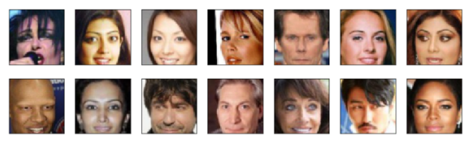
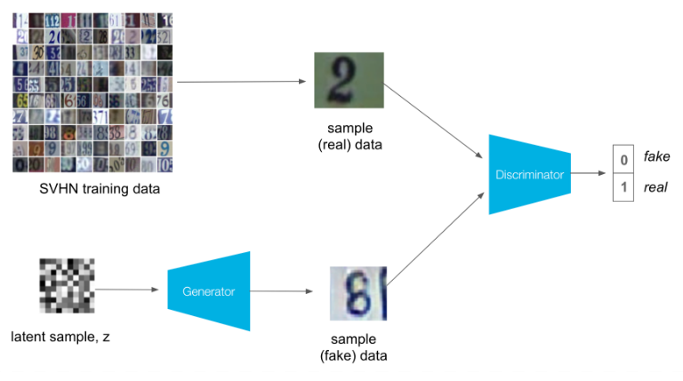
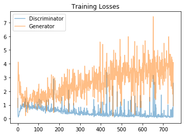
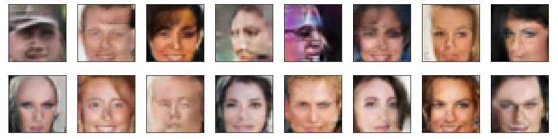

# Face-Generation
This Repository stores my solution to the "Face Generation" problem presented as the fourth project in the Deep Learning Nano Degree by Udacity.

# Overview
For this project I was given a preprocessed dataset of celebrities faces, which can be downloaded [here]("https://s3.amazonaws.com/video.udacity-data.com/topher/2018/November/5be7eb6f_processed-celeba-small/processed-celeba-small.zip"). 

# Purpose
The Goal of this project was to create a general adverserial Neural Network (GAN) to generate new "fake" celebrity faces.

# Methadology
To train the image generator, a descriminator is needed that could decipher whether an image is real or fake. This descriminator is trained with alternating real and "fake" generated images. The descriminator is trained with the generator, leading to improvement in both models over time. As a result of this process, we create a generator that generates "fake" images which the decriminator cannot detect and these images can visually look quite real.

The Below process depicts the GAN training process of on the SVHN dataset.

# Results 
The achieved loss for the trained generator and descriminator can be found below:

Some of the images this generator created can be seen below:

# Conclusion
This project introduced me to the concepts of general adverserial nerual networks. It broughtt me into the world of fake celebrity generation and the capabilities of this technology. Furthering this project I learnt about pix2pix and Cycle GANS which can take images from one domain (such as a real photo) and convert them to another domain (such as a painting). This can be achieved with supervised (paired), fully unsupervised or semi-supervised approach. By adding the cyucling consistency loss, the resulting image can beconverted back to its origional form aswell.

To view the full project click [here](https://nbviewer.jupyter.org/github/MrDaubinet/Face-Generation/blob/master/dlnd_face_generation.ipynb) 
